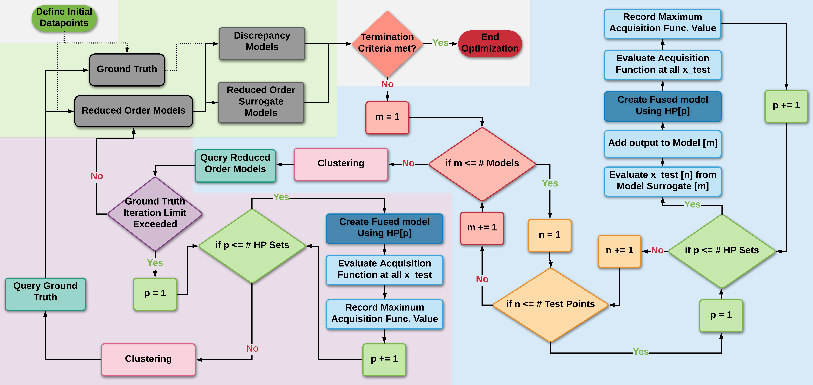

# BAREFOOT (Batch Reification/Fusion Optimization) Framework
## Batch Bayesian Optimization implemented within a Model Reification and Fusion Framework

This framework combines the Reification/Fusion framework developed by Thomison and Allaire<sup>1</sup> with the Batch Bayesian Optimization approach proposed by Joy et al.<sup>2</sup>. The general overview of the framework is shown in the figure below. The description of this framework and how it operates can be found in articles published in the literature<sup>3,4</sup>.




To run the code, the following python packages will need to be installed:
- pandas
- numpy
- scipy
- pyDOE
- scikit-learn
- george
- matplotlib

There are several command line inputs that are required by the code, these are described below and an example of the function call is shown after the descriptions:
1. GP Kernel to be used ('M52', 'M32', 'SE')
2. The total number of iterations to completed
3. The number of test samples to use (these are found using a latin-hypercube sampling of the design space
4. The number of hyperparameter sets to use in the batch optimization procedure
5. The number of clusters (medoids) to partition the data into
6. The number of iterations to run before calling the truth model
7. The total budget that can be expended before stopping the code
8. The budget that must be expended before calling the truth model
9. additional ..

The code is set up to run an example problem if no additional inputs are entered. This example code will run for two iterations. The example code is equivalent to entering the following run command:

```
python CC_CC_optimization.py M52 2 10 50 2 1 14000 1000
```


